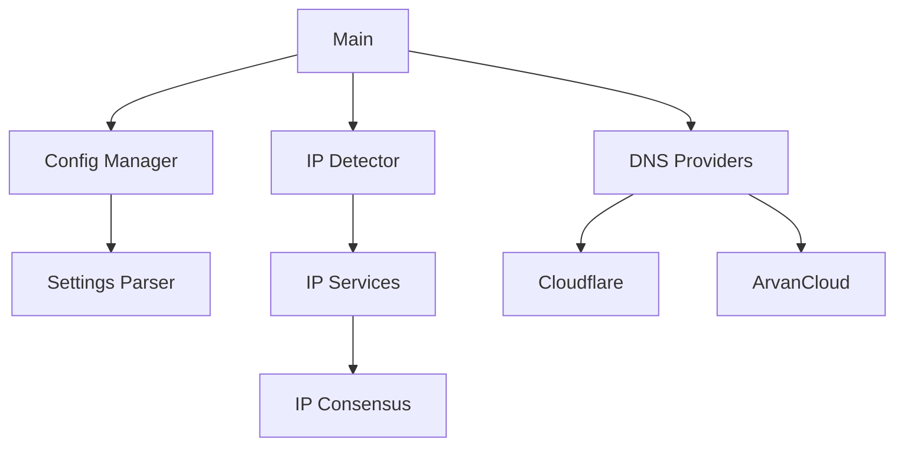

# Architecture Overview

This document describes the high-level architecture of Fariba DDNS Client.

## System Components



## Core Components

### 1. Configuration Management (`settings/`)
- Handles TOML configuration parsing
- Manages environment variables
- Validates configuration
- Provides typed configuration access

### 2. IP Detection (`utility/ip_detector/`)
- Multiple IP detection services
- Consensus-based validation
- IPv4 and IPv6 support
- Network interface monitoring

### 3. DNS Providers (`providers/`)
- Provider-agnostic interface
- Rate limiting and retry logic
- Error handling and recovery
- Async operations

### 4. Core Runtime (`functions.rs`)
- Main application loop
- Graceful shutdown handling
- Error recovery
- Metrics collection

## Data Flow

1. **Startup**
   ```
   Load Configuration
   ↓
   Initialize Providers
   ↓
   Start IP Detection
   ↓
   Begin Update Loop
   ```

2. **Update Cycle**
   ```
   Check IP Changes
   ↓
   Validate IP (Consensus)
   ↓
   Update DNS Records
   ↓
   Wait for Interval
   ```

3. **Shutdown**
   ```
   Receive Signal
   ↓
   Stop Update Loop
   ↓
   Cleanup Resources
   ↓
   Exit
   ```

## Key Design Decisions

### Async Runtime
- Uses Tokio for async operations
- Efficient resource utilization
- Non-blocking I/O operations

### Error Handling
- Custom error types per module
- Error propagation chain
- Detailed error context
- Recovery mechanisms

### Configuration
- TOML-based configuration
- Environment variable override
- Strong type safety
- Runtime validation

### Provider Interface
```rust
#[async_trait]
pub trait Provider {
    async fn update_records(&self, ip: &str) -> Result<(), Error>;
    async fn validate_config(&self) -> Result<(), Error>;
    // ... other trait methods
}
```

## Module Structure

### `src/main.rs`
- Application entry point
- Runtime initialization
- Signal handling
- High-level error handling

### `src/functions.rs`
- Core application logic
- Update loop implementation
- Provider coordination
- Error recovery

### `src/settings/`
- Configuration parsing
- Environment handling
- Validation logic
- Type definitions

### `src/providers/`
- Provider implementations
- API client code
- Rate limiting
- Error handling

### `src/utility/`
- Shared utilities
- IP detection
- Network helpers
- Common types

## Security Considerations

### Authentication
- Secure credential storage
- API token management
- Environment variable usage

### Network Security
- HTTPS for all API calls
- Certificate validation
- Request timeouts

### Error Handling
- No sensitive data in logs
- Secure error messages
- Rate limit handling

## Performance Considerations

### Resource Usage
- Minimal memory footprint
- Efficient network usage
- Controlled concurrency

### Optimization
- Connection pooling
- Request batching
- Cache utilization

### Monitoring
- Performance metrics
- Error tracking
- Resource usage

## Future Improvements

1. **Planned Features**
   - Additional DNS providers
   - Enhanced IP detection
   - Metrics export
   - Web interface

2. **Technical Debt**
   - Configuration refactoring
   - Error handling improvements
   - Test coverage
   - Documentation updates

3. **Optimizations**
   - Connection pooling
   - Cache implementation
   - Request batching
   - Resource usage 